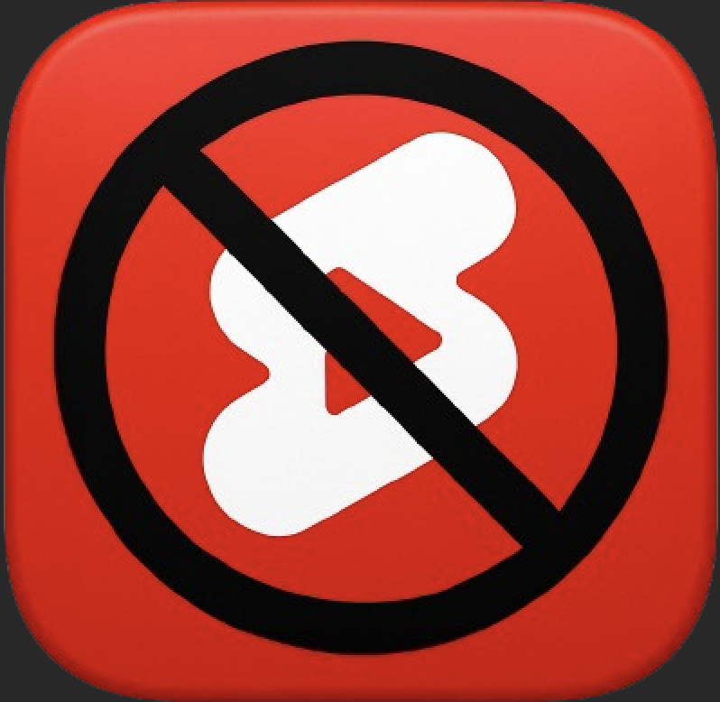

# 🚫 AvoidYoutubeShorts

<div align="center">
  
  <h3>Your YouTube Shorts blocker and productivity companion</h3>
  <p>Stay focused on meaningful content by blocking YouTube Shorts with enhanced statistics, pause/resume functionality, and beautiful UI.</p>
  <p>
    <a href="https://github.com/hereisSwapnil/AvoidYoutubeShorts">
      <strong>GitHub Repository: hereisSwapnil/AvoidYoutubeShorts</strong>
    </a>
  </p>
</div>

## ✨ Features

- 🚫 **Smart Shorts Blocking**: Automatically hides YouTube Shorts content across the platform
- 📊 **Statistics Dashboard**: Track your viewing habits and productivity gains
- ⏸️ **Pause/Resume Control**: Temporarily enable/disable blocking when needed
- 🎨 **Beautiful UI**: Seamless integration with YouTube's design
- ⚡ **Lightweight**: Minimal impact on YouTube page performance
- 🔒 **Privacy-First**: No data collection - everything stays local
- 🎯 **Enhanced Focus**: Stay productive and avoid short-form content distractions

## 🚀 Quick Start

### Option 1: Clone and Build (Recommended)

1. **Clone the repository**:
   ```bash
   git clone https://github.com/hereisSwapnil/AvoidYoutubeShorts.git
   cd AvoidYoutubeShorts
   ```

2. **Install dependencies**:
   ```bash
   npm install
   ```

3. **Build the extension**:
   ```bash
   npm run build
   ```

4. **Load in Chrome**:
   - Open Chrome and go to `chrome://extensions/`
   - Enable "Developer Mode" (toggle in top right)
   - Click "Load unpacked" and select the `dist-prod/` folder
   - The extension will appear in your extensions list

### Option 2: Download ZIP

1. Download the ZIP file from the [GitHub repository](https://github.com/hereisSwapnil/AvoidYoutubeShorts)
2. Extract to a folder
3. Follow steps 3-4 from Option 1

## 🎯 How to Use

1. **Navigate to YouTube** and the extension will automatically activate
2. **Click the extension icon** in your browser toolbar to access controls
3. **View statistics** to see your productivity improvements
4. **Use pause/resume** when you need temporary access to Shorts
5. **Customize settings** through the options page for personalized experience

**Pro tip**: The extension works automatically - just install it and forget about it while enjoying distraction-free YouTube!

### Key Features Explained

| Feature | Description | Benefit |
|---------|-------------|---------|
| 🚫 **Auto-Blocking** | Hides Shorts content automatically | Immediate distraction removal |
| 📊 **Statistics** | Track blocked content and time saved | Motivation and awareness |
| ⏸️ **Pause Control** | Temporarily disable blocking | Flexibility when needed |
| 🎨 **Seamless UI** | Integrates naturally with YouTube | No visual disruption |
| ⚡ **Performance** | Lightweight and fast | No impact on browsing speed |

## 🔧 Development

### Prerequisites
- Node.js (v14 or higher)
- Google Chrome browser

### Development Commands

```bash
# Install dependencies
npm install

# Build for production
npm run build:prod

# Build for development (faster)
npm run build:dev

# Clean build files
npm run clean

# Validate extension files
npm run validate

# Create distributable package
npm run build
```

### Project Structure
```
├── manifest.json          # Extension configuration
├── content.js            # Main content script for YouTube
├── script.css            # Styles for blocking elements
├── popup.html            # Extension popup interface
├── popup.js              # Popup functionality
├── options.html          # Settings page
├── options.js            # Options page functionality
├── background.js         # Background service worker
├── build.js              # Build script
├── icons/                # Extension icons
│   └── icon.png          # Extension icon
├── dist-prod/            # Production build (generated)
└── package.json          # NPM configuration
```

## 🔒 Privacy & Security

- ✅ **Local Storage**: All data stored securely in Chrome's storage
- ✅ **No Data Collection**: No user data collected or transmitted
- ✅ **No Tracking**: No analytics or tracking scripts
- ✅ **Open Source**: Transparent code for complete trust

## 🛠️ Troubleshooting

### Common Issues

| Problem | Solution |
|---------|----------|
| Extension not working | Ensure you're on YouTube.com and extension is enabled |
| Shorts still visible | Refresh the page or check if blocking is paused |
| Statistics not updating | Check extension permissions and refresh the page |
| UI elements missing | Try reloading the extension or clearing cache |

### Getting Help

1. Check that you're on a YouTube page (`youtube.com`)
2. Verify the extension is enabled in Chrome extensions
3. Try refreshing the YouTube page
4. Check the extension popup for any error messages

## 📦 Technical Details

- **Manifest Version**: 3 (latest Chrome extension standard)
- **Permissions**: 
  - `activeTab`: Interact with YouTube pages
  - `storage`: Save settings and statistics
  - `tabs`: Monitor YouTube tabs
  - `notifications`: Show productivity updates
  - `scripting`: Inject content scripts
- **Host Permissions**: `https://www.youtube.com/*`
- **Content Scripts**: Automatically injected on YouTube pages

## 🤝 Contributing

We welcome contributions! Here's how you can help:

1. **Fork** the repository
2. **Create** a feature branch (`git checkout -b feature/amazing-feature`)
3. **Commit** your changes (`git commit -m 'Add amazing feature'`)
4. **Push** to the branch (`git push origin feature/amazing-feature`)
5. **Open** a Pull Request

### Development Guidelines

- Follow existing code style
- Add comments for complex logic
- Test your changes thoroughly
- Update documentation if needed

## 📄 License

This project is open source and available under the [MIT License](LICENSE).

## 🙏 Acknowledgments

- Built with ❤️ for better productivity
- Enhanced by AI Assistant for improved functionality
- Icons and design created with care

---

<div align="center">
  <p><strong>Made with ❤️ for distraction-free YouTube browsing</strong></p>
  <p>⭐ Star this repo if it helps you stay focused!</p>
</div>
